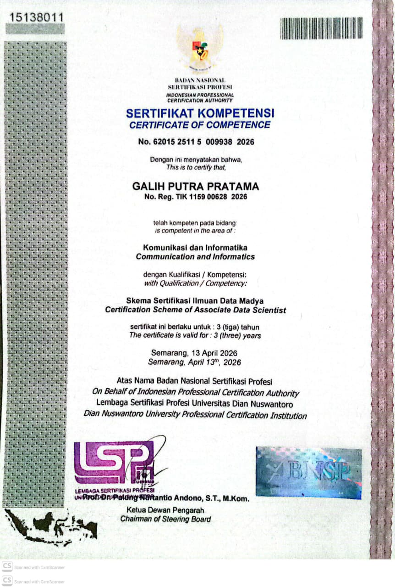

# Halo semua! 👋

Perkenalkan, nama saya **Galih Putra Pratama**.
Saya adalah mahasiswa **Informatics Engineering** di **Universitas Dian Nuswantoro (Udinus)**.

Saat ini saya sedang mendalami peran sebagai **AI Engineer** dan **Machine Learning Researcher**. Saya memiliki minat besar dalam mengintegrasikan kecerdasan buatan ke dalam solusi dunia nyata, mulai dari klasifikasi gambar hingga keamanan sistem berbasis AI.

### 🚀 Tentang Saya
* 🤖 **Fokus Saat Ini**: Sedang menempuh program **Coding Camp 2026 by DBS Foundation** pada jalur **AI Engineer** untuk memperdalam arsitektur model dan deployment.
* 🎓 **Proyek Tugas Akhir**: Full-stack implementasi model *Deep Learning* menggunakan arsitektur **EfficientNetV2** untuk sistem klasifikasi sampah otomatis.
* 🛡️ **Cybersecurity**: Memperkuat sistem AI melalui sertifikasi profesional **IBM Cybersecurity Analyst**.
* 💻 **Keahlian Teknis**: Pengembangan model *Deep Learning* (Python, TensorFlow/Keras), integrasi API dengan FastAPI, dan analisis data prediktif.
* 🌏 **Visi Karier**: Beraspirasi menjadi AI Engineer di tingkat global dan pakar keamanan siber di Indonesia.

### 🏆 Sertifikasi Terbaru

  

**Associate Data Scientist** - *Badan Nasional Sertifikasi Profesi (BNSP)*
*Kompeten dalam bidang Komunikasi dan Informatika dengan kualifikasi Ilmuan Data Madya.*

### 📫 Mari Terhubung!
Jika kamu tertarik untuk berdiskusi lebih lanjut tentang AI atau kolaborasi proyek, silakan hubungi saya melalui:
* **LinkedIn**: [Galih Putra Pratama](https://www.linkedin.com/in/galih-putra-pratama/)

### 📊 GitHub Stats

  
  

